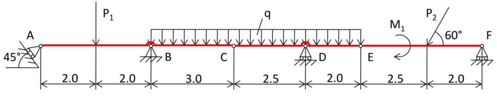
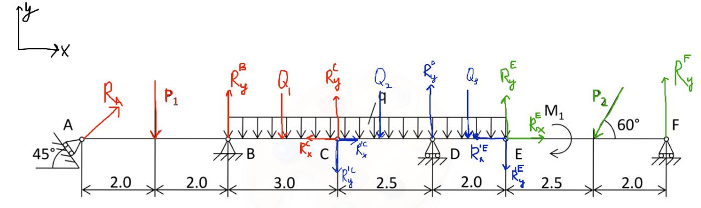
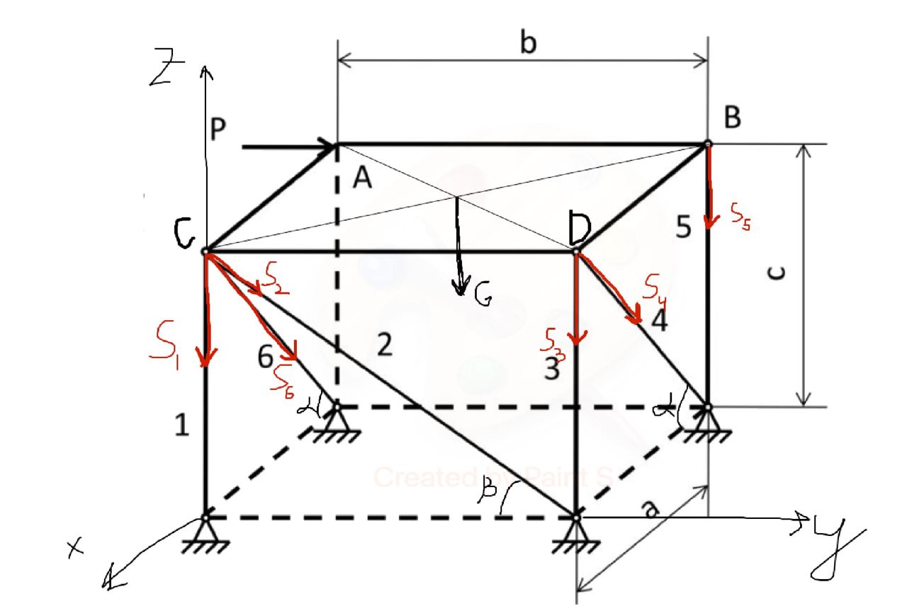

# Task 1

## Problem:

Determine reaction forces and the forces in the interim pins of the
composite stud. *P*1 = 12, *P*2 = 18,
*M*1 = 36,*q* = 1.4

## Solution:

"For the system to be in static equilibrium, there must be three rods:
AC, CE, EF" – A. Maloletov.  
<u>Research object:</u> system of 3 rods: AC, CE, EF  
Here is the picture:  
  
<u>Method:</u> static  
<u>Body is fixed:</u>  
A – Roller support, *R**A* - perpendicular to it floor  
B – Pin connection, *R**x*, *R**y*  
C – Rotational joint, *R**x*, *R**y*  
D – Roller support, *R**y*  
E – Rotational joint, *R**x*, *R**y*  
F – Roller support, *R**y*  
The next step was to draw the reactions:  
  
Where *Q*1 = 3*q*, *Q*2 = 2.5*q*,
*Q*3 = 2*q* – representation of a distributed force as a 3
forces. There is no *R**x**B* because we consider
AC as one rigid body, it has internal horizontal reactions, but they
compensate each other.  
<u>Force analysis:</u>  
Known: *P*1, q, M1, *P*2  
Unknown: *R**A*, *R**y**B*,
*R**x**C*, *R**y**C*,
*R**y**D*, *R**x**E*,
*R**y**E*, *R**y**F*.  
<u>Solution:</u>  
I started from stud EF:  
$$\begin{cases}
    ox: R^E_x - P_2 cos(60\degree) = 0\\\\
    oy: R^E_y - P_2 sin(60\degree) + R^F_y\\\\
    M_E: -M_1 - P_2 sin(60\degree) 2.5 + R^F_y 4.5 = 0
     \end{cases}$$
From the system above I got:
$$\begin{split}
    \underline{\underline{R^F_y \approx 16.66025}}\\\\
    \underline{\underline{R^E_y \approx -1.07179}}\\\\
    \underline{\underline{R^E_x =9}}
     \end{split}$$

The stud CE:
$$\begin{cases}
    ox: R^{'C}\_x - R^{'E}\_x = 0\\\\
    oy: - R^{'C}\_y - Q_2 + R^D_y - Q_3 - R^{'F}\_y = 0\\\\
    M_C: -Q_2 \frac{2.5}{2}+ R^D_y 2.5 - Q_3 3.5 - R^{'E}\_y 4.5 = 0
     \end{cases}$$
\|*R**x*′*C*\| = \|*R**x**C*\|
,\|*R**y*′*C*\| = \|*R**y**C*\|  
From the system (3) I got:
$$\begin{split}
    \underline{\underline{R^D_y \approx 3.740778}}\\\\
    \underline{\underline{R^C_x = 9}}\\\\
    \underline{\underline{R^C_y \approx -1.487432}}
     \end{split}$$

The stud AC:
$$\begin{cases}
    ox: R_A cos(45\degree) - R^{C}\_x = 0\\\\
    oy: R_A sin(45\degree - P_1 + R^B_y - Q_1 + R^C_y = 0\\\\
    M_A: -P_1 2 + R^B_y 4 - Q_1 5.5 + R^C_y 7 =  0
     \end{cases}$$

From the system (5) I got:
$$\begin{split}
    \underline{\underline{R^B_y \approx -14.378006}}\\\\
    \underline{\underline{R_A = 12.7279}}\\\\
     \end{split}$$

# Task 2

## Problem:

Determine the reaction forces in rods supporting a thin horizontal
rectangular plate of weight G under action of force P applied along the
side AB.  
*G* = 18,*P* = 30, *a* = 4, *b* = 4.5, *c* = 3.5

## Solution:

<u>Research object:</u> system of rods and horizontal rectangular plate.
<u>Method:</u> static  
<u>Body is fixed:</u>  
B – Pin connection, *R**x*, *R**y*,
*R**z*  
C – Pin connection, *R**x*, *R**y*,
*R**z*  
D – Pin connection, *R**x*, *R**y*,
*R**z*  
4 bottom supports with pin connections, *R**x*,
*R**y*, *R**z*  
Here is the picture:  
  
<u>Force analysis:</u>  
Known: *P*, *G*  
Unknown:
*S*1,*S*2,*S*3,*S*4,*S*5,*S*6.  
<u>Solution:</u>  
I wrote equation of moments around axis and equation of forces:
$$\begin{cases}
    M\_{ix}:  S_3 b + S_4 sin(\alpha) b + S_5 b + G \frac{b}{2} = 0\\\\
    M\_{iy}: S_5 a + G\frac{a}{2}= 0 \\\\
    M\_{iz}: P a - S_4cos(\alpha) b = 0\\\\
    ox: -S_6 cos(\alpha) - S_4 cos(\alpha) = 0\\\\
    oy: S_2 cos(\beta) + P = 0\\\\
    oz: -S_1 - S_6 sin(\alpha) - S_2 sin(\beta) - S_3 - S_4 sin(\alpha) - S_5- S_6 = 0\\\\
    sin(\alpha) = \frac{c}{\sqrt{a^2+c^2}}\\\\
    sin(\beta) = \frac{c}{\sqrt{b^2+c^2}}\\\\
    cos(\beta) = \frac{b}{\sqrt{b^2+c^2}}\\\\
    \end{cases}$$

From this system I got:
$$\begin{split}
    \underline{\underline{S_1 \approx -14.7710257}}\\\\
    \underline{\underline{S_2 \approx 38.00586}}\\\\
    \underline{\underline{S_3 \approx -17.56233}}\\\\
    \underline{\underline{S_4 \approx 26.67}}\\\\
    \underline{\underline{S_5  = -9}}\\\\
    \underline{\underline{S_6 \approx -26.67}}\\\\
     \end{split}$$
