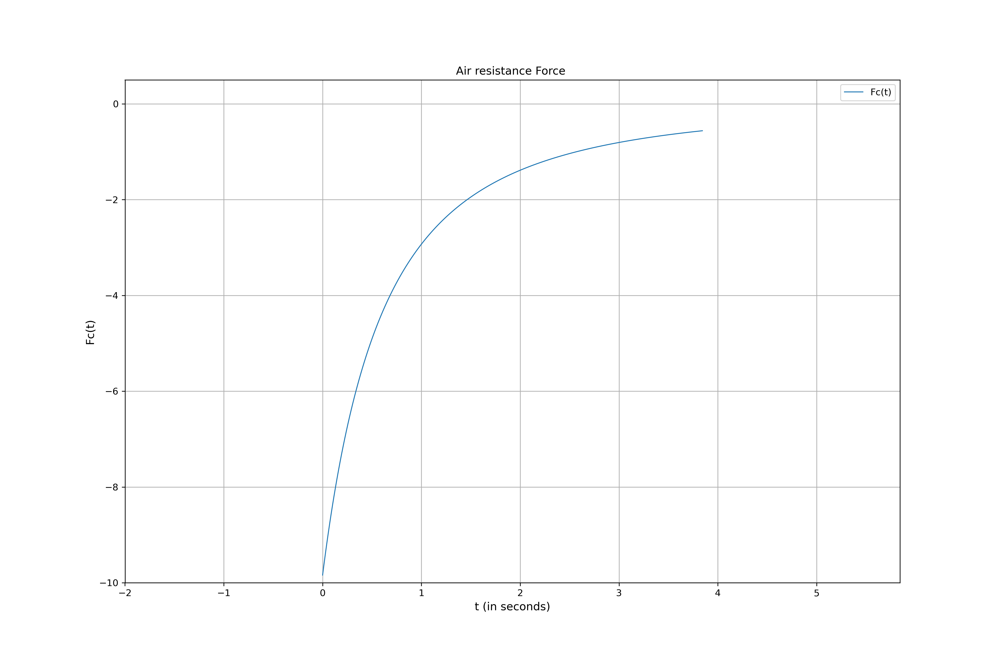
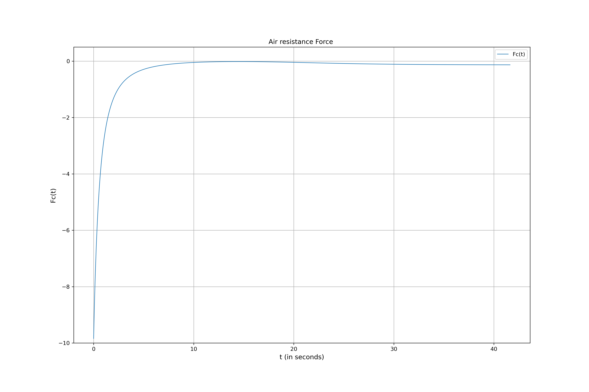
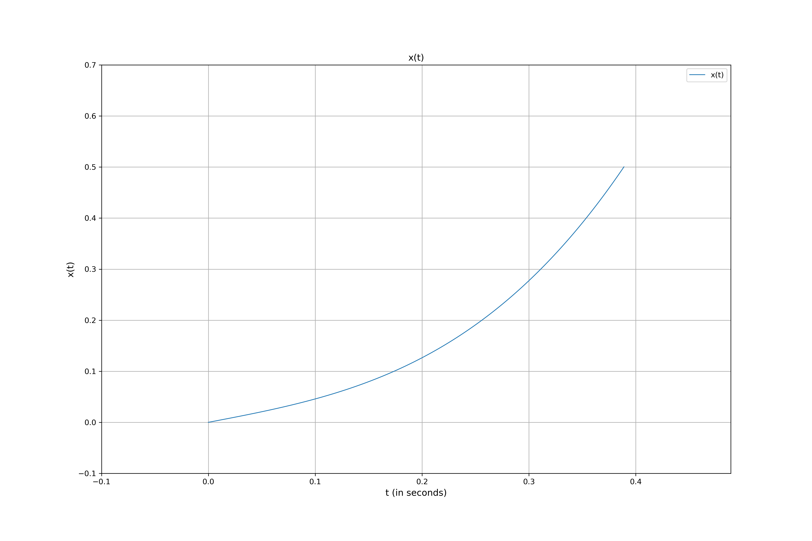
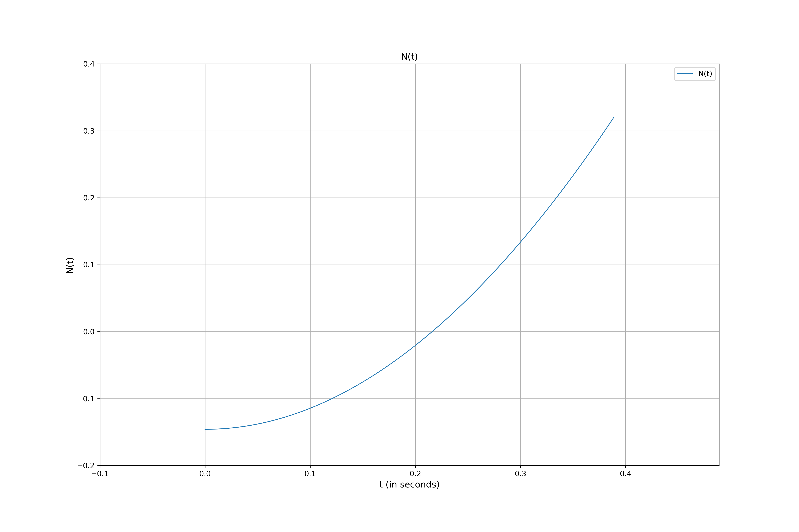
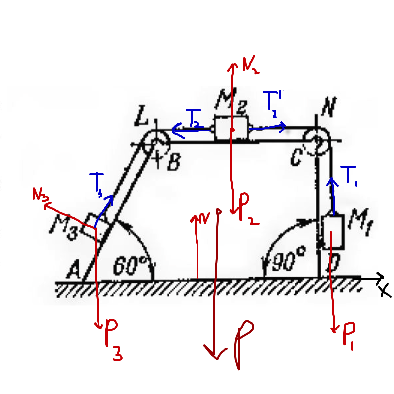

# Task 1

## Problem:

The legend about the sniper.  
1. Find *α* which is needed to shoot the officer.  
2. What the max height of cargo ship can be to make this shot?  
3. Find *α* taking into consideration air resistance:
*F**c*(*v*2) =  − *k**v**v⃗*  
*L* = 1500m, *m* = 13.6g, *k* = 1.3 \* 10−5,
*v*0 = 870m/s, *g* = 9.81*m*/*s*2

## Solution:

<u>Research object:</u> Bullet  
<u>Motion:</u> Translatory  
<u>Condition:</u>  
Initial: *x*0 = 0, *ẋ*0 = *v*0,
*t* = 0;  
"final": *x**f* = *L*, *ẋ**f* = *v*0,
*t* = ?;  
"H": *x**H* = *L*/2, *ẋ**H* = ?, *t* = ?;  
<u>Force analysis:</u>  
For 1-2 questions: *m**g⃗*  
For the 3rd question: $\Vec{F_c}$, *m**g⃗*  
<u>Solution:</u>  
1. There 2 different *α* for the sniper to shot the officer. One of the
angle can be found using school formula of ballistics :
$$\begin{split}
        L = \frac{v^2_0 sin(2\alpha)}{g}\\\\
        \alpha = \arcsin(\frac{gL}{v^2_0})\\\\
        \alpha_1 \approx 0.556982 \degree\\\\
        \alpha_2 = (180 - \alpha_1\*2)/2 \approx 89.443\degree
    \end{split}$$
2. Max height of the ship is at the centre of river (middle of distance
L) and also can be calculated using school formula:
$$\begin{split}
        H = \frac{v^2_0 sin^2(\alpha)}{2g}\\\\
        \alpha_1: H\_{max} \approx 3.6455583m\\\\
        \underline{\underline{\alpha_2: H\_{max} \approx 38574.336m}}\\\\
    \end{split}$$
3. This task requires more efforts, I wrote the 2nd Newton’s law and
projections on coordinates.
$$\begin{split}
        x: ma_x = -F_c cos(\alpha) = -k v^2\\\\
        y: ma_y = -mg-F_c sin(\alpha)
    \end{split}$$
The equation above can be rewritten in differential form:  
$$\begin{cases}
    \frac{dV_x}{dt} = - \frac{k}{m}\sqrt{V^2_x + V^2_y}V_x\\\\
    \frac{dV_y}{dt} = - g - \frac{k}{m}\sqrt{V^2_x + V^2_y}V_y\\\\
\end{cases}$$
Numerical calculation of the system of nonlinear differential equations
gives:
$$\begin{split}
        \underline{\underline{\alpha_1 \approx 1.86784\degree}}\\\\
        \underline{\underline{\alpha_2 \approx 68.65180\degree}}\\\\
    \end{split}$$
All calculations can be found in colab: Link:
<https://colab.research.google.com/drive/1IQBCqrKOnkBtLquocZN67vyyrzIYXEyp?usp=sharing>  
Graphs for the *α*1:  
  
Graphs for the *α*2:  
  

# Task 2

## Problem:

A particle M is moving inside of the cylindrical channel of moving
object A with radius *r*.  
Determine the equation of relative motion *x* = *f*(*t*). Find the
pressure force the particle acting on the channel wall. I consider the
case, when M starts its motion from the center of A.  
1. Simulate the mechanism.  
2. Show all the accelerations and forces.  
3. Plot the *x*(*t*) till point won’t leave the channel.  
4. plot *N*(*t*).  
*m* = 0.02, *ω* = *π*, *r* = 0.5  

## Solution:

<u>Research object:</u> System of particle M and object A.  
<u>Motion:</u> A – rotational, M - translatory  
<u>Condition:</u>  
Initial: *x*0 = 0, *ẋ*0 = 0.4, *t* = 0;  
"final": *x**f* = *r*, *ẋ**f* = ?, *t* = ?;  
<u>Force analysis:</u>  
known: G  
unknown: N, *Φ**e**c*, *Φ**c**o**r*  
<u>Solution:</u>  
1. The simulation is available here:  
Link: <https://www.geogebra.org/m/wd7qdhks>  
2. All forces and accelerations shown in simulation.  
3. To find *x*(*t*) I used Newton’s Second law:
$$\begin{split}
        m\Vec{a} = \Vec{\Phi^c_e} + \Vec{G} + \Vec{\Phi\_{cor}} + \Vec{N}\\\\
        x: m\ddot x = \Phi^c_e + Gsin(\omega t) = m\omega^2x+mgsin(\omega t)\\\\
    \end{split}$$
The full solution of this differential equation is:
*x* = *C*1*e**ω**t* + *C*2*e*−*ω**t* + *A**s**i**n*(*ω**t*) + *B**c**o**s*(*ω**t*)
From (6) I got that *B* = 0 and $A = -\frac{g}{2\omega^2}$  
To calculate *C*1, *C*2 I substituted initial
conditions and got:  
$$\begin{cases}
        C_1 + C_2 = 0\\\\
        \omega(C_1-C_2)- \frac{g}{2\omega} = 0.4\\\\
\end{cases}
\begin{cases}
        C_2 = (-0.4 - \frac{g}{2\omega})\frac{1}{2\omega}\\\\
        C_1 = -C_2\\\\
\end{cases}$$
The full equation of motion is:
$$\underline{\underline{ x = C_1 e^{\omega t} +  C_2 e^{-\omega t} + A sin(\omega t)+ B cos(\omega t)}}$$
  
Plot is here:  
  
4. N was calculated with Newton’s Second law but in direction which is
perpendicular to *x* of particle.  
$$\begin{split}
        0 = N + \Phi_cor - Gcos(\omega t)\\\\ 
        N =  2mV\_{rel}\omega - mgcos(\omega t)\\\\
    \end{split}$$
  

# Task 2

## Problem:

There are 3 weights connected with an ideal string. When 1 does down on
*l* = 1 meter the system shifts on distance S. Find the S  
*m*1 = 20 kg, *m*2 = 15 kg, *m*3 = 10
kg, *m* = 100 kg  

## Solution:

<u>Research object:</u> System of 3 weights and prism ABC.  
<u>Motion:</u> 1,2,3, ABC – translatory  
<u>Condition:</u>  
Initial: *x*0 = 0, *ẋ*0 = 0, *t* = 0;  
"final": *x**f* = ?, *ẋ**f* = ?, *t* = ?;  
<u>Force analysis:</u>  
Look at the picture:  
  
known: P1, P2, P3, P, N1, N2, N3, N  
unknown: T1, T’2, T2, T3  
<u>Solution:</u>  
Second Newton’s law:
$$\begin{split}
        m\ddot x_c = 0 = P1 + P2 + P3+  P+ N1+ N2+ N3+ N +T1+ T'2+ T2+ T3 \\\\ 
        m\dot x_c = C_1, C_1 = 0\\\\
        mx_c = C_2, C_2 = 0\\\\
    \end{split}$$
The center of mass of the system has not moved, but suppose the ABC
moved to the left on S. Conditions for bodies:  
initial: *x*1, *x*2, *x*3,
*x**A**B**C*  
final: *x*1 − *S*, *x*2 − *S* + *l*,
$x_3-s + lcos(60\degree)$, *x**A**B**C* − *S*  
$$\begin{split}
        \frac{m_1x_1 + m_2x_2+m3x_3+mx\_{ABC}}{m_1+m_2+m_3+m} = \\\\\frac{m_1(x_1-s) + m_2(x_2-S+l)+m3(x_3-S+lcos(60\degree))+m(x\_{ABC}-S)}{m_1+m_2+m_3+m}\\\\ 
        \underline{\underline{S = \frac{l(m_2 + m_3/2)}{m_1+m_2+m_3+m} = \approx 0.138 m}}\\\\
    \end{split}$$
