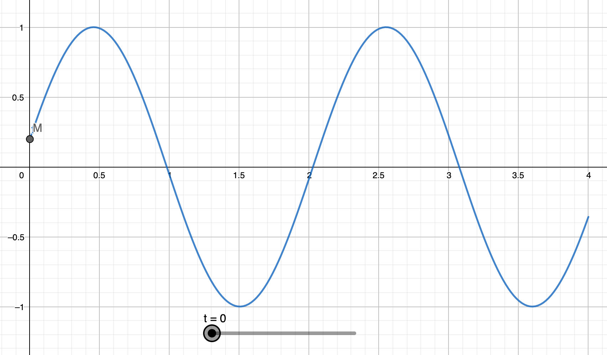
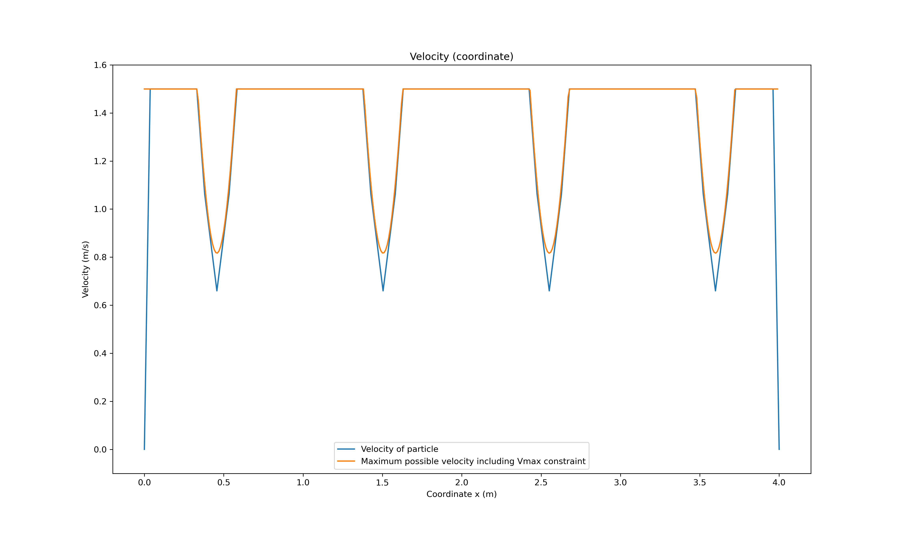
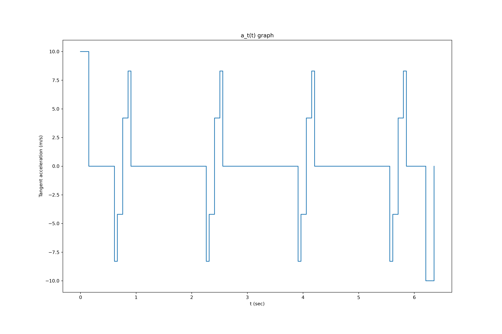
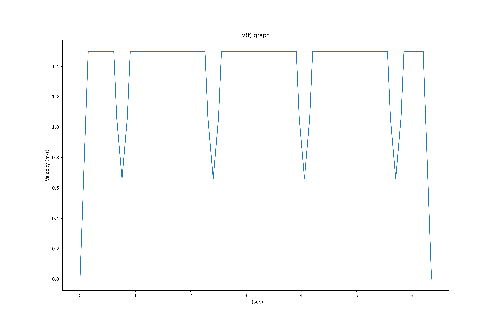
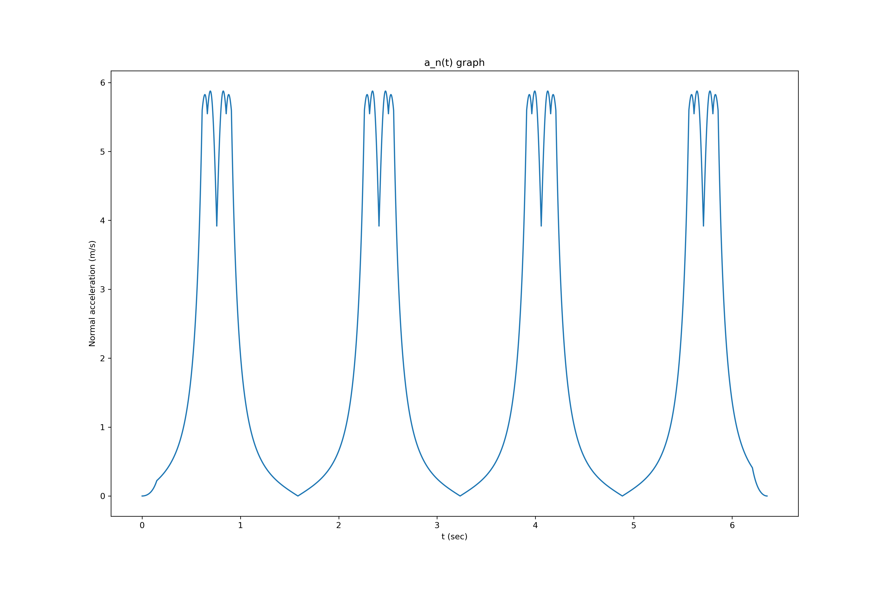
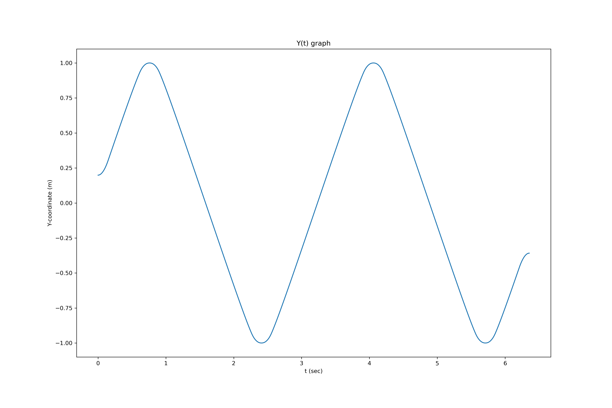

# Task

## Problem:

We have a mobile vehicle, which should survive after the track. We have
some predefined trajectory, which is given in y(x) format — our goal to
pass this trajectory as fast as possible. But at the end of the course,
there is a drop-off. It means that we should stop our machine at the end
of the trajectory. We have to establish some constraints, such as max
tangent acceleration (max power on the motor) and normal (road
adhesion). Despite it, the best way is to represent our robot as a
particle. How should we move (speed and acceleration) for solving such a
task?  
Parameters:  
$$\begin{split}
        A = 1, om=3, \theta_0 = 0.2\\\\
        a\_{t\_{max}} = 10 m/s^2\\\\
        a\_{n\_{max}} = 6 m/s^2\\\\
        v\_{max} = 1.5 m/s\\\\
        y(x) = A \sin(om \* x + \theta_0)\\\\
    \end{split}$$
*x* exists on \[0,4\]

## Solution:

1\) The first step was a simple analysis of the task – plot the
*y*(*x*), intuitively find the critical points.  
  
On the picture above you can see the trajectory of a mobile vehicle. The
*x*-axis is horizontal, *y*-axis is vertical, *t* is a parameter used to
write equation in parametric form.  
Intuitively I realized that there are at least 4 critical regions which
are the regions around maximum amplitude of function *y*(*x*).  
2) The second step was analytical analysis of maximum speed which can be
reached with a given normal acceleration. To find the speed I used
simple equation:
$$a\_{n\_{max}} = \frac{V^2}{R}$$
Where *R* is a radius of curvature, *V* - velocity at a given point. To
find the radius of curvature I firstly found *κ* – curvature coefficient
(<https://ru.wikipedia.org/wiki/%D0%9A%D1%80%D0%B8%D0%B2%D0%B8%D0%B7%D0%BD%D0%B0>),
I choose the *t* as a parameter:

$$\begin{gathered}
    \gamma = 
        \begin{cases}
            x = t\\\\
            y = A \sin(om \* t + \theta_0)
        \end{cases}\\\\
        \kappa = \frac{\|\dot \gamma \times \ddot \gamma\|}{\dot \gamma ^3}\\\\
        \kappa = \frac{-A\*om^2 \*\sin(om\*t+\theta_0)}{(1+A^2 \* om^2 \cos (om\*t+\theta_0))^{\frac{3}{2}}}\\\\
        R = \frac{1}{\kappa}
    
\end{gathered}$$

The values of *V* led me to a simple solution – just decelerate before
and on these critical regions and accelerate after. A few words about
finding the intervals of critical regions: I found them empirically and
took a little reserve to be sure, that the vehicle can
decelerate/accelerate with *a**t**m**a**x*.  
Several attempts to choose the proper accelerations on these regions (I
choose them to be as close as possible to the previously calculated
*V*)  
After this I plotted the graph of possible velocity including
*v**m**a**x* constraint, and also accelerate at the start and
decelerated at the end:  
  
A few words about finding the minimum values of *V*: they correspond to
*y*(*x*) = *A*, and solving this equation I found points when *y*(*x*)
reaches its max and min values; after that I choose symmetric intervals
from the points (found them experimentally).  
So, as you can see from the graph above, I did not violate any
constraints – the solution is correct and simple. Let me calculate the
total time:  
I know the velocity with respect to *x*, and to find time I considered
the lengths of curvature *S*  
$$S = \int\_{x_a}^{x_b} \sqrt{1+(y'(x))^2} \\,dx$$
Calculating time for each interval gave me <u><u>time  ≈ 6.3571
sec</u></u> , which is satisfactory result.  
The graph of tangential acceleration:  
  
  
The graph of velocity with respect to time was plotted using graph of
tangential acceleration:  
  
To find normal acceleration I should find the velocity with respect to
time at any second. The way I plotted the previous graph is not suitable
here, so, I should split the whole time-interval to small *d**t*’s and
then I can find velocity at each moment and then plot graphs of normal
acceleration and *y*(*t*). I also know tangential acceleration at any
time, I denoted it as *a* below. I found *d**t* for each position of a
vehicle (*x**a*):
$$\begin{gathered}
    v(t) dt = \sqrt{1+(y'(x_a))^2} dx\\\\
    dt = \frac{\sqrt{1+(y'(x_a))^2}dx}{v(t)} \\\\
    a = \frac{V^2_f - V^2_s}{2\sqrt{1+(y'(x_a))^2} dx}\\\\
    V_f = \sqrt{2\* \sqrt{1+(y'(x_a))^2} dx \* a(t) + V^2_s}
\end{gathered}$$
Formula (10) is a simple kinematics formula, but instead of path I have
a small increment of the path. *V**s* - velocity of a vehicle
at time *t*, *V**f* - velocity of a vehicle at time
*t* + *d**t*. I found *d**t* for each *d**x* (I choose *d**x* = 0.000001
sec. to keep accuracy). Moreover, the sum of all *d**t*’s is  ≈ 6.3571
which means the correctness of calculations.

The graph of normal acceleration:  
  
  
The graph of *y*(*t*):  
  
All the computations can be found in colab: Link:
<https://colab.research.google.com/drive/1kXE8jZwbxDu67IVt18EGh1fdaOIbeV8V?usp=sharing>

## Conclusion:

The main goal in the task was to decelerate/accelerate as soon/late as
*a**t* allows and check whether the *a**n* was not
exceeded on the critical regions and keep the *v**m**a**x*
everywhere where it was possible. Following these considerations I got
time *t* ≈ 6.3571.
