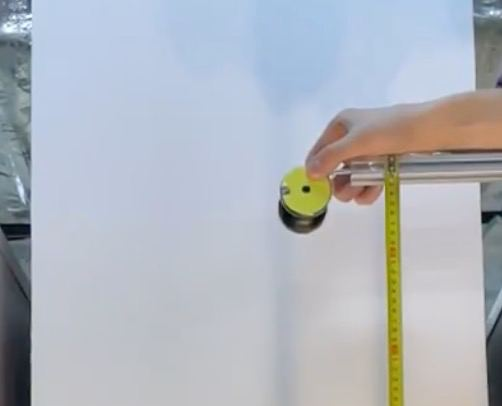
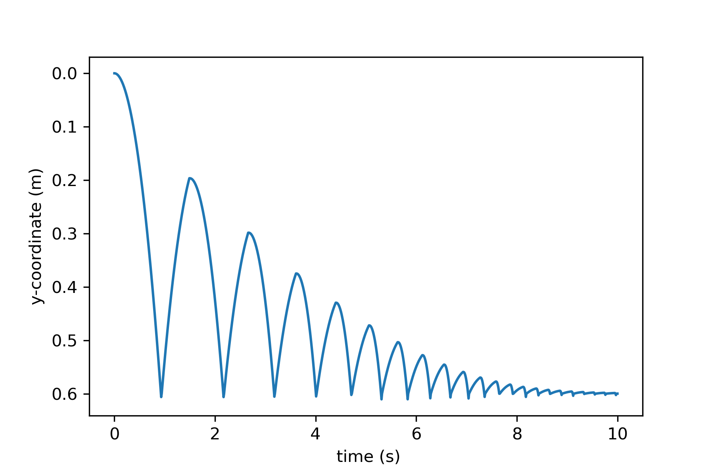
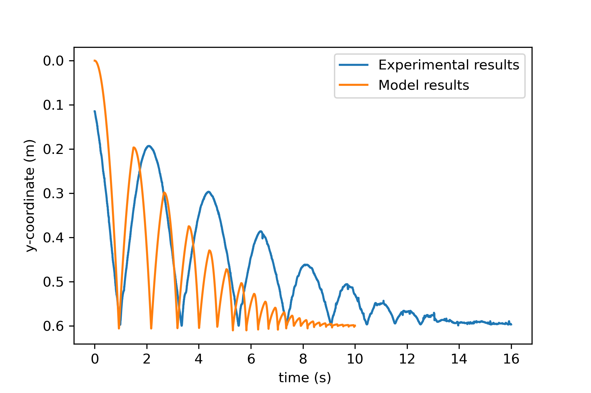
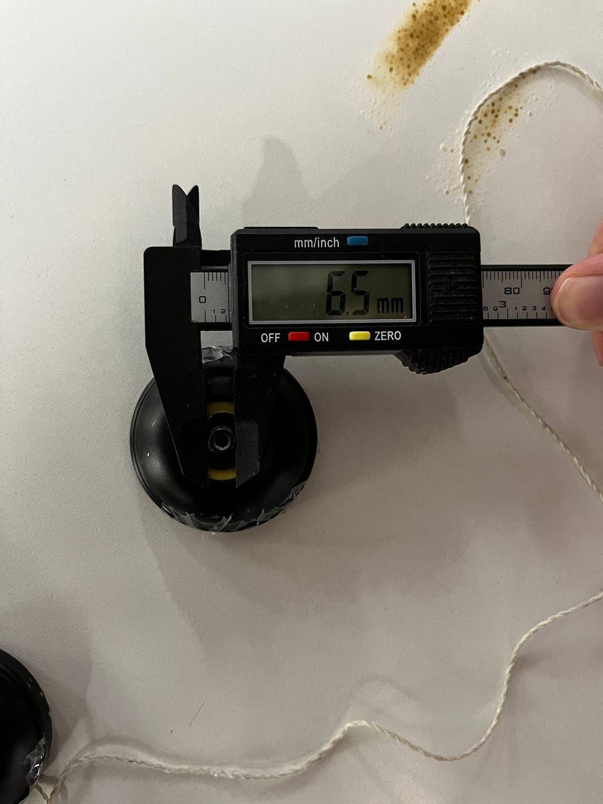
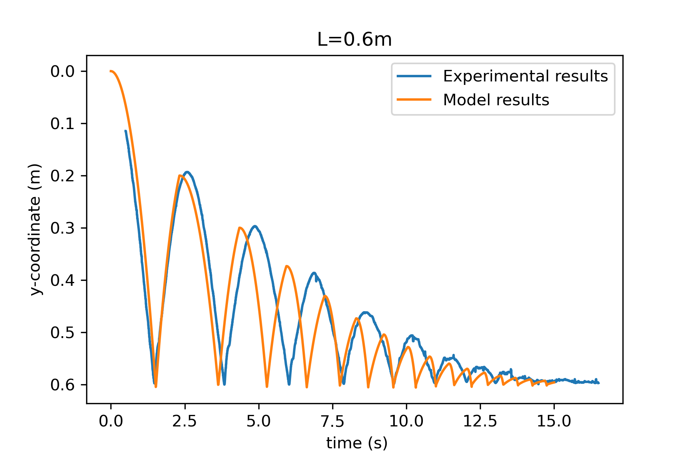
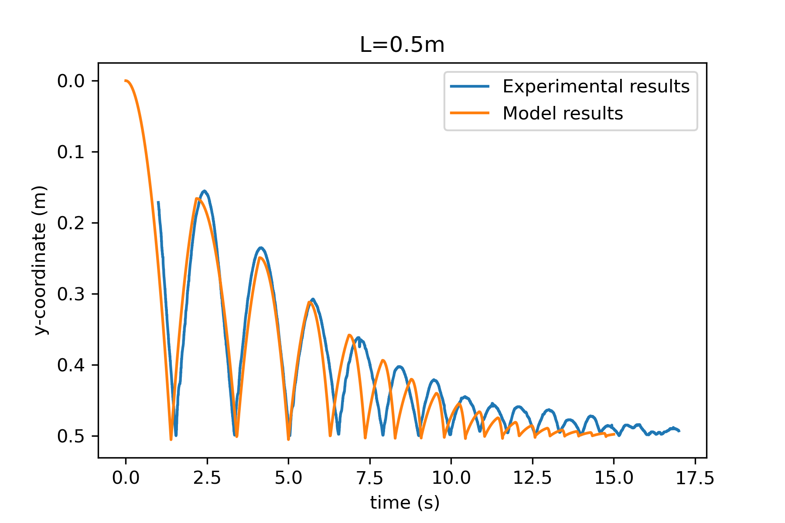
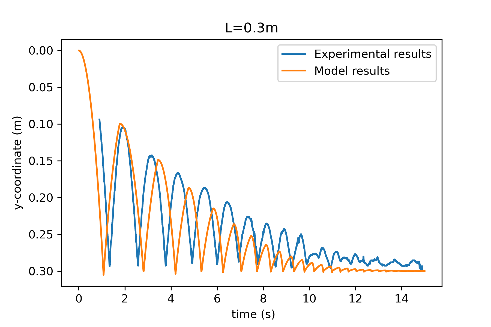
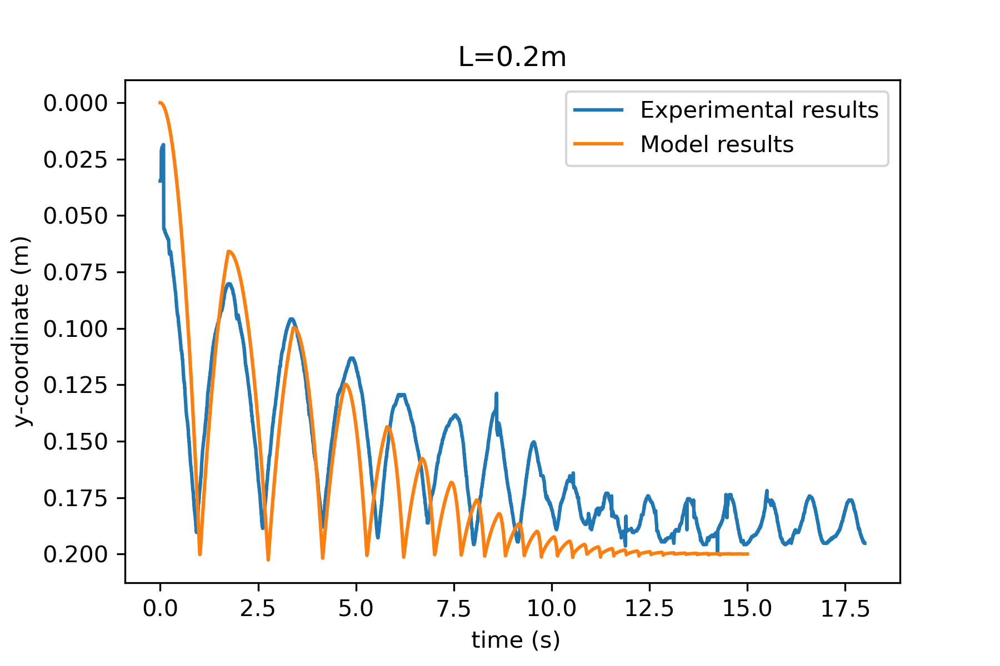
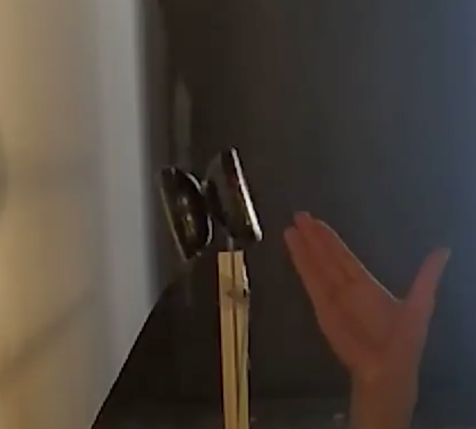

# Task

Yo-yo is fixed on the corner of the table. It will begin to unwind after
unfixing due to the gravity force. This yo-yo is designed in such a way
that, having unwound, it starts to come back, but not to the full
height. The process of movement is an analog of a damping pendulum. The
task is as follows. It is necessary to find the number of oscillations
before complete attenuation, as well as the height by which the yo-yo
rises each time. In order to solve this problem, it is necessary to
conduct an experiment and develop a mathematical model. This model must
be grounded. It is also necessary to compare the simulation result and
experimental results.

## Tools:

1\. Python (NumPy, MatPlotLib)  
2\. 2 cameras  
3\. Calipers  
4\. Scotch-tape

## Experiments:

There was 15 experiments total: 5 different length and 3 experiments for
each length.  
Big thanks to Lev Kozlov who shared the data from the video-experiments
in JSON format\! Do not forget to visit his GitHub
<https://github.com/lvjonok>

| experiment | string-length (m) | oscillations in 1st repetition | oscillations in 2nd repetition | oscillations in 3rd repetition | Mean + std       |
| :--------- | :---------------- | :----------------------------- | :----------------------------- | :----------------------------- | :--------------- |
| No. 1      | 0.6               | 8                              | 19                             | 9                              | 12 +/- 4.967     |
| No. 2      | 0.5               | 9                              | 14                             | 9                              | 10.667 +/- 2.357 |
| No. 3      | 0.4               | 11                             | 10                             | 9                              | 10 +/- 0.816     |
| No. 4      | 0.3               | 10                             | 10                             | 10                             | 10 +/- 0         |
| No. 5      | 0.2               | 6                              | 10                             | 8                              | 8 +/- 1.633      |

Each experiment was recorded on 2 cameras: front-camera to track
y-coordinate (left image) and bottom-camera to track rotations around
string (right image)  
   
Oscillation amplitude over first 5 oscillations (Mean for each
experiment):  

| experiment | 1st oscillation (m) | 2nd oscillation (m) | 3rd oscillation (m) | 4th oscillation (m) | 5th oscillation (m) |
| :--------- | :------------------ | :------------------ | :------------------ | :------------------ | :------------------ |
| No. 1      | 0.6                 | 0.41                | 0.3                 | 0.22                | 0.14                |
| No. 2      | 0.5                 | 0.35                | 0.235               | 0.19                | 0.135               |
| No. 3      | 0.4                 | 0.275               | 0.21                | 0.16                | 0.125               |
| No. 4      | 0.3                 | 0.27                | 0.14                | 0.215               | 0.195               |
| No. 5      | 0.2                 | 0.11                | 0.09                | 0.07                | 0.055               |

## Mathematical Model:

There are several ways to represent the motion of yo-yo. I tried to
create model which describes yo-yo in 2 DoF.  
I wrote the equation which describes kinetic and potential energy of
yo-yo, then I introduced a special term (\(d\)) which generalizes losses
in kinetic energy due friction, resistance and etc. \(n\) is a number of
oscillation  
\[\begin{split}
        T_2 - T_1=\Pi_2-\Pi_1\\
        d^n(\frac{1}{2}mV^2 + \frac{1}{2}J\omega^2) = mgy(t)\\
        V = \dot y\\
        \omega = \frac{V}{r}\\
        J = m\rho^2
    \end{split}\] y-axis directed to the floor, \(r\) - inner radius of
yo-yo, \(J\) - inertia of yo-yo, \(\rho\) - inertia radius  
The equation (1) describes only downward motion of yo-yo, here is the
equation when the body moves upward.  
\[d^n(\frac{1}{2}mV^2 + \frac{1}{2}J\omega^2) = mg(L-y(t))\\\] These
equations gives such trajectory (\(d\) = 0.75, L = 0.6m)  
  
Lets try compare this model with experimental results:  
  
As you can see, there are differences in frequency, but the amplitude is
precise enough.  
I measured yo-yo parameters again and noticed that the inner radius
changes significantly – it should cause a change in the frequency of
oscillations.  
   
The left picture above shows the inner radius at the very bottom point
of trajectory, the right picture shows the inner radius at the very top
of motion (L=0.6m).  
Here is the table which represents relation between inner radius and
starting length

| Length (m) | max radius (mm) |
| :--------- | :-------------- |
| 0.6        | 15.3            |
| 0.5        | 14.9            |
| 0.4        | 13.2            |
| 0.3        | 11.5            |
| 0.2        | 10.9            |

  
The graph above shows that the inner radius changes approximately
linearly with change of length.  
Lets use this information and upgrade equation (1), just introduce
\(r=r(y)\). Simulations gives such results:  
   
   
  
As you can see below the model gives really good results in most of the
cases for the first 4 oscillations. Lets try to take into consideration
rotation of yo-yo around the string.  
My assumption about a cause of such rotations is gyroscopic effect.  
  
The goal is to find \(\Omega\) and compare results with experiments.  
Let denote \(K_0 = J\omega\) as angular momentum of yo-yo and
\(M_0 = F_{tension} r\) as sum of all moment of tension force (suppose
this is the only one force apllied to it). I just followed Alexander
Maloletov’s slides:  
\[\begin{split}
        \frac{dK_0}{dt} = M_0\\
        \frac{d \Vec{OB}}{dt} = V_B\\
        \frac{d \Vec{OB}}{dt} \textasciitilde M_0\\
        \Vec{V_B} = \Vec{\omega} \Vec{OB} \textasciitilde \Omega \times K_0\\
        \Omega \times K_0 = M_0\\
        \Omega = \frac{M_0}{J\omega}\\
        M_0 = F_{tension} l\\
        F_{tension} = m(g-\ddot y)
    \end{split}\] Where \(l\) is a lever arm for the tension force  
Knowing \(\Omega\) I found that yo-yo should rotate on about
10\(\degree\) for the first oscillation, but it did not (1-2\(\degree\)
max).  
   
As you can see, the gyroscopic effect does not converge with experiments
due to naive assumption that the lever arm is always constant. Moreover,
the thread is laid randomly, which is why the gyroscopic effect does not
matter at all. But I at least tried to connect some not magical laws to
rotations in 3D.  
There is another reason – string (method of weaving is spiral). At the
very bottom position yo-yo faces sharp hit - velocity changes its
direction, acceleration is very high, and, therefore, the tension in
string is very high and the net tries to unwind. This "unwind effect"
maybe rotates yo-yo.

## Conclusion:

The model I provided works good for the first several oscillations of
yo-yo. To minimize differences I tried to take into consideration more
parameters, but still the model is not so complex. In real life yo-yo is
affected by many forces, some of them are difficult to measure.
Moreover, yo-yo is never used when it is fixed on some stick, we usually
play with it, changing the height of end of rope.
